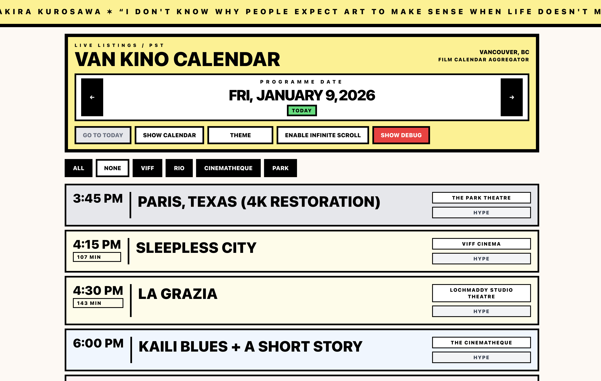

# Van Kino Calendar



Van Kino Calendar is a site (built with TanStack + Cloudflare Worker, deployed on Cloudflare) that scrapes and normalizes the daily film programs from VIFF Centre, Rio Theatre, The Cinematheque, and The Park Theatre into one feed.

## Development

```bash
pnpm install       # once
pnpm dev           # run Vite on http://localhost:3000
pnpm build         # SSR/client bundle
pnpm deploy        # build + wrangler deploy
```

> Tip: when Cloudflare D1 is available locally, bind it as `HYPE_DB`; otherwise hype counts simply stay in memory.
